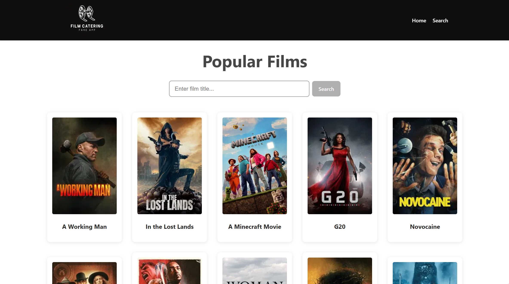
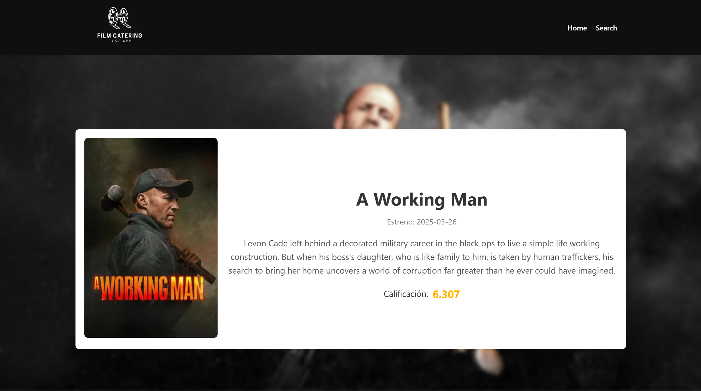
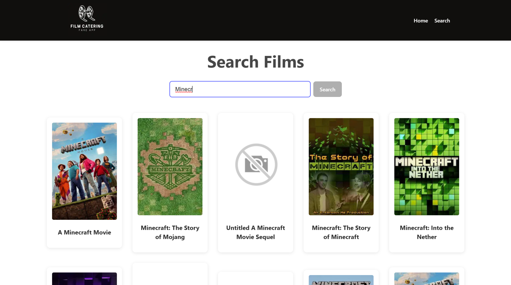

# Movie App SSR

Este proyecto es una aplicación web construida con React, que permite a los usuarios explorar una lista de películas de manera interactiva y dinámica, utilizando React y React Router DOM para gestionar las rutas del lado del cliente. (SPA)

## Funcionalidades principales

- **Página de Inicio:** Muestra una lista de películas populares obtenidas desde The Movie Database API.
- **Detalle de Película:** Al hacer clic en una película, se muestra una página con su información detallada (título, fecha de estreno, descripción y calificación).
- **Búsqueda de Películas:** Una barra de búsqueda permite a los usuarios encontrar películas por su título.

## Capturas de pantalla de la aplicación





## Demostración

Puedes probar la aplicación desplegada en Github Pages aquí:
[Movie App SPA](https://danielcaldes.github.io/movie-app-spa/)

## Instrucciones de Uso

1. Clona este repositorio:
   ```bash
   git clone https://github.com/DanielCaldes/movie-app-ssr.git
   cd movie-app-ssr
   ```
2. Instala las dependencias:
   ```bash
   npm install
   ```
3. Crea un archivo `.env.local` en la raíz del proyecto, basado en el archivo `.env.local.example`.
4. Agrega tu clave de API de The Movie Database (TMDB) en el archivo `.env.local`.
5. Inicia el entorno de desarrollo:
   ```bash
   npm run dev
   ```

### Ejecutar tests
```bash
    npm vitest run
```

### Generar archivos de producción y desplegar a Github Pages
1. Generar los archivos de producción:
    ```bash
    npm run build
    ```
2. Copiar el archivo 404.html a la carpeta de build "dist"
    ```bash
    cp 404.html dist
    ```
    Esto permitirá realizar un enrutamiento a la página principal si se recarga alguna de las páginas.
3. Desplegar la aplicación a Github Pages
    ```bash
    npm run deploy
    ```

## Estructura del proyecto
```bash
📁 public/                        // Favicon y fichero .nojeklly para que github permita renderizar 404.html
📁 src/
├── 📁 assets/                    // Imágenes y recursos
├── 📁 components/
│   ├── 📄 Footer.jsx             // Pie de página de la aplicación
│   ├── 📄 Footer.test.jsx        // Tests para footer
│   ├── 📄 Header.jsx             // Encabezado con navegación hacia búsqueda y la página principal
│   ├── 📄 Header.test.jsx        // Tests para header
│   ├── 📄 MovieCard.jsx          // Tarjeta de presentación de una película
│   ├── 📄 MovieCard.test.jsx     // Tests para movie card
│   ├── 📄 MovieList.jsx          // Componente para mostrar una lista de películas
│   ├── 📄 MovieList.test.jsx     // Tests para movie list
│   ├── 📄 SearchBar.jsx          // Barra de búsqueda para encontrar películas
│   └── 📄 SearchBar.test.jsx     // Tests para search bar
├── 📁 pages/
│   ├── 📄 Home.jsx               // Página de inicio
│   ├── 📄 MovieDetail.jsx        // Página de detalles de una película específica
│   └── 📄 Search.jsx             // Página de resultados de búsqueda
├── 📄 App.css                    // Estilos de la aplicación
├── 📄 App.jsx                    // Componente principal con las rutas
├── 📄 index.css                  // Estilos globales
├── 📄 main.jsx                   // Archivo de entrada para renderizar la aplicación
├── 📄 setupTests.jsx             // Archivo de configuración global de pruebas
📄 .env                           // Archivo de configuración local con API_KEY
📄 .env.example                   // Archivo de ejemplo para configuración del entorno local
📄 404.html                       // Página de enrutamiento de nuevo a index si se recarga la página
📄 index.html                     // HTML principal
```
